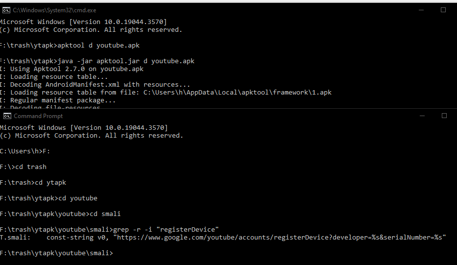
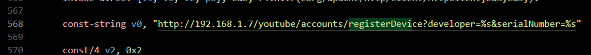
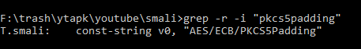
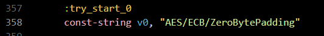
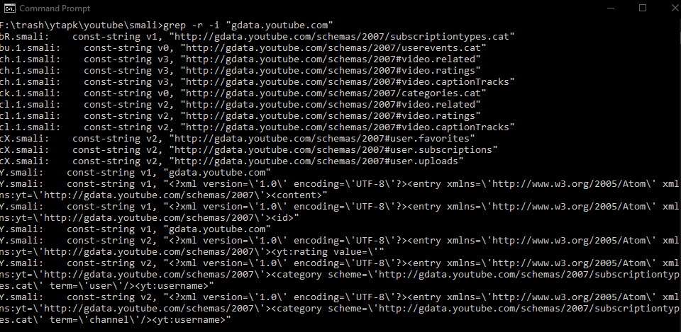
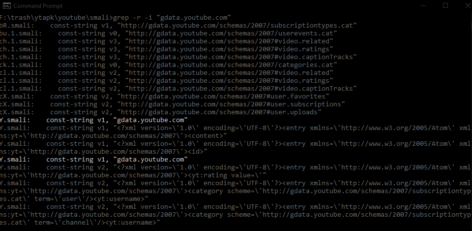
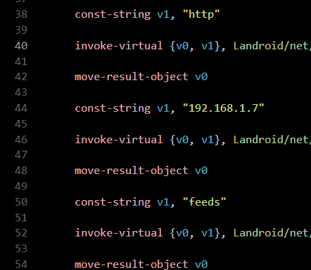

# ANDROID APP SETUP - YT2009

if you'd like to have an android app for your instance users, you can get an old youtube apk working (2.x-4.1.23)
by setting it up to connect to your yt2009 server.

NOTES:
- later APKs (5.x) won't work as they used InnerTube instead of the Data API V2.
- your instance needs to be on port 80. if you're running a standard webserver there, set it up to redirect
`/feeds/api/*` requests to your instance.
- earlier APKs require a lot more work to get running, and some (1.6.20 and earlier) don't work on
modern android at all.

PREREQUISITES:
- downloaded an old youtube APK (apkmirror will work)
- java installed and in PATH (accessible from every directory)
- apktool
- grep (download and put to PATH if on Windows)
- [ApkRenamer](https://github.com/dvaoru/ApkRenamer) for installing the modified app along with the stock
youtube app
- an APK signer. [uber-apk-signer](https://github.com/patrickfav/uber-apk-signer) will be used throughout this doc.

## decompiling the APK
open a terminal/cmd in the directory you downloaded apktool to.

**you can use a wrapper script to not write `java -jar apktool.jar` all the time.**

**this is also mentioned in the apktool docs. here's an example wrapper for windows:**
```
java -jar apktool.jar %*
```
**save this as `apktool.bat` in the same directory as apktool.**

place the downloaded youtube apk into the same dir as apktool.

*throughout this doc, `youtube.apk` will be used in place of the apk file name. make sure to replace as needed.*

from the terminal window, run:
```
apktool d youtube.apk
```

this will create a `youtube/` folder containing all the things you need.

## changing strings to connect to yt2009

open a new terminal window inside `youtube/smali/`.

---

from there, run:
```
grep -r -i "registerDevice"
```



open the file grep returns as the one containing the text. replace the domain to your yt2009 instance.

if your yt2009 instance is on a different port than 80, here, you can put the port directly.



---

next up, we need to slightly change the encoding algorithm the registration will use to decode the key
yt2009 will provide.

precisely, from `AES/ECB/PKCS5Padding` to `AES/ECB/ZeroBytePadding`.

to do that, run:
```
grep -r -i "pkcs5padding"
```



once again, open the file and change the text.



---

next, you'll need to change the domain for the actual API.

originally, it was **gdata.youtube.com**. so put that into grep!

```
grep -r -i "gdata.youtube.com"
```



**a lot of stuff there, but you don't need to change it all!**

you're mainly looking for the entries where gdata.youtube.com is separated. looking back at the screenshot above:



open the file and change the strings. **ONLY INCLUDE THE IP ADDRESS/DOMAIN NAME YOU'RE USING.**

**ANY PREFIXES OR ANYTHING AFTER (HTTP, PORT, ETC) WILL CRASH THE APP ON START.** 



change the HTTPS to HTTP if present above the domain name.

---

## recompile

go back to your terminal window you used to decompile the apk. run
```
apktool b youtube
```

to rebuild the APK. **replace youtube with the directory name if different!**

this will create a `dist` folder in your `youtube`. it will contain an unsigned apk.

**because the APK is unsigned, you can't install it yet.**

---

## changing package name

if you'd like to be able to install your modded app alongside the stock youtube app, you will need to change its package name.

you can use ApkRenamer mentioned in the prerequisites to do that.

start a terminal inside the apkrenamer directory, and piece together your command. example:

```
java -jar renamer.jar -a F:\trash\ytapk\youtube\dist\youtube.apk -o F:\trash\ApkRenamer\out\ -d -p ftde0.yt2009
```

follow the instructions in the README of [ApkRenamer](https://github.com/dvaoru/ApkRenamer) for more info and options.

## if needed: sign

apkrenamer may or may not sign the apk it makes *(what is it dependent on?)*. if it doesn't it adds "unsigned" to the end of the filename.

if it does, congrats! install the apk and enjoy.

if it doesn't:

open a terminal inside uber-apk-signer dir and run:

```
java -jar <uber-apk-signer-filename> -a <path-to-apk>
```

this will sign the apk using debug/test keys.

refer to the help of uber-apk-signer if you need more info.

after you get the signed apk, install as normal on your device.