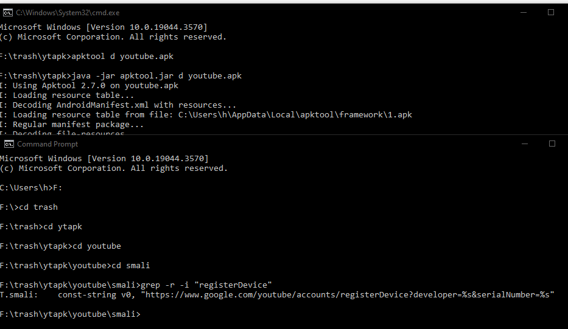
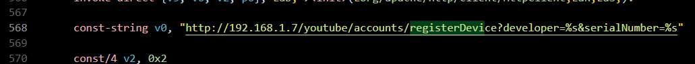
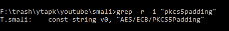
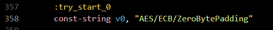
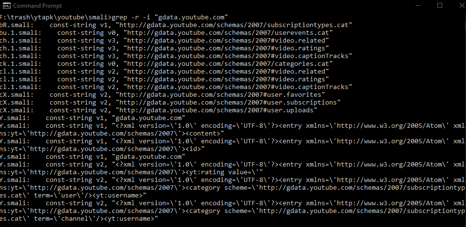
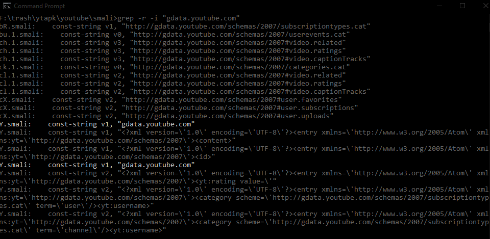
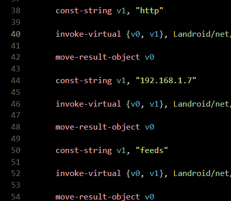

# ANDROID APP SETUP - YT2009

if you'd like to have an android app for your instance users, you can get an old youtube apk working (2.x-4.1.23)
by setting it up to connect to your yt2009 server.

NOTES:
- later APKs (5.x) won't work as they used InnerTube instead of the Data API V2.
- your instance needs to be on port 80. if you're running a standard webserver there, set it up to redirect
`/feeds/api/*` requests to your instance.
- earlier APKs require a lot more work to get running (1.6.20 and earlier). they don't work on
modern android at all. some are documented at the bottom of this page.
- for earlier APKs (1.6.20 and earlier) issues will only be addressed when tested with real devices.

PREREQUISITES:
- downloaded an old youtube APK (apkmirror will work)
- java installed and in PATH (accessible from every directory)
- apktool
- grep (for Windows you can use `findstr`, will work in a similar way)

***if you decide to use `findstr`, replace all `-r` switches with `-s` and add a `[space] *` to the end of each command.***

- [ApkRenamer](https://github.com/dvaoru/ApkRenamer) for installing the modified app along with the stock
youtube app
- an APK signer. [uber-apk-signer](https://github.com/patrickfav/uber-apk-signer) will be used throughout this doc.

## decompiling the APK
open a terminal/cmd in the directory you downloaded apktool to.

**you can use a wrapper script to not write `java -jar apktool.jar` all the time.**

**this is also mentioned in the apktool docs. here's an example wrapper for windows:**
```
java -jar apktool.jar %*
```
**save this as `apktool.bat` in the same directory as apktool.**

place the downloaded youtube apk into the same dir as apktool.

*throughout this doc, `youtube.apk` will be used in place of the apk file name. make sure to replace as needed.*

from the terminal window, run:
```
apktool d youtube.apk
```

this will create a `youtube/` folder containing all the things you need.

## changing strings to connect to yt2009

open a new terminal window inside `youtube/smali/`.

---

from there, run:
```
grep -r -i "registerDevice"
```



open the file grep returns as the one containing the text. replace the domain to your **HTTP** yt2009 instance.

if your yt2009 instance is on a different port than 80, here, you can put the port directly.



---

next up, we need to slightly change the encoding algorithm the registration will use to decode the key
yt2009 will provide.

precisely, from `AES/ECB/PKCS5Padding` to `AES/ECB/ZeroBytePadding`.

to do that, run:
```
grep -r -i "pkcs5padding"
```



once again, open the file and change the text.



---

next, you'll need to change the domain for the actual API.

originally, it was **gdata.youtube.com**. so put that into grep!

```
grep -r -i "gdata.youtube.com"
```



**a lot of stuff there, but you don't need to change it all!**

you're mainly looking for the entries where gdata.youtube.com is separated. looking back at the screenshot above:



open the file and change the strings. **ONLY INCLUDE THE IP ADDRESS/DOMAIN NAME YOU'RE USING.**

**ANY PREFIXES OR ANYTHING AFTER (HTTP, PORT, ETC) WILL CRASH THE APP ON START.** 



change the HTTPS to HTTP if present above the domain name.

---

## recompile

go back to your terminal window you used to decompile the apk. run
```
apktool b youtube
```

to rebuild the APK. **replace youtube with the directory name if different!**

this will create a `dist` folder in your `youtube`. it will contain an unsigned apk.

**because the APK is unsigned, you can't install it yet.**

---

## changing package name

if you'd like to be able to install your modded app alongside the stock youtube app, you will need to change its package name.

you can use ApkRenamer mentioned in the prerequisites to do that.

start a terminal inside the apkrenamer directory, and piece together your command. example:

```
java -jar renamer.jar -a F:\trash\ytapk\youtube\dist\youtube.apk -o F:\trash\ApkRenamer\out\ -d -p ftde0.yt2009
```

follow the instructions in the README of [ApkRenamer](https://github.com/dvaoru/ApkRenamer) for more info and options.

## if needed: sign

apkrenamer may or may not sign the apk it makes *(what is it dependent on?)*. if it doesn't it adds "unsigned" to the end of the filename.

if it does, congrats! install the apk and enjoy.

if it doesn't:

open a terminal inside uber-apk-signer dir and run:

```
java -jar <uber-apk-signer-filename> -a <path-to-apk>
```

this will sign the apk using debug/test keys.

refer to the help of uber-apk-signer if you need more info.

after you get the signed apk, install as normal on your device.

## version-specific changes: 1.3 - 1.4.20(?)

- `PKCS7Padding` may be used instead of `PKCS5Padding` --> change to `ZeroBytePadding` as usual.
- break out a flawed `for` loop in `readInfoLine` - see `readInfoLine` section below.
- don't throw the whole parser when crlf read fails - see `readCRLF` section below.

## version-specific changes: 1.5.20 - 1.6.21(?)

- find a `GDATA_SERVER` variable with grep and change it to the ip/domain of your yt2009 instance.
- follow `shouldUseMasf` below.

## shouldUseMasf

- find the `shouldUseMasf` function with grep, open the .smali file corresponding to it.

\* note: may be obfuscated.

as MASF connections are not reverse engineered (and can't reliably be so due to their usage throughout multiple google services at the time),

we're looking to set this function to always return `false` to use gdata.

as seen in 1.5.20 and 1.6.20, the function starts with a number of registers used.

```
.locals 4
```

we only need 1 to return a result, so this can be changed to

```
.locals 1
```

next, there will be a prologue where some initial values will be set.

```
.prologue

const/4 v3, 0x1

const/4 v2, 0x0
```

in smali, the number after a `v` is the register's index within its scope (this function in our case) and starts with a 0.

as we only need 1 variable, it can have a 0 index and have a value of `0x0` (`0x0` == `0` == false)

```
.prologue

const/4 v0, 0x0
```

next up will be a "line" indicator, where the actual check code begins.

```
.line 231
```

keep this one in, and remove everything until the end of the function (`.end method`) to end up with an empty function.

```
.method public shouldUseMasf()Z
    .locals 1

    .prologue
    const/4 v0, 0x0

    .line 231

.end method
```

^ like so!

that line we kept can now be used to return our value of our `v0` register, simply by doing `return v0`.

in whole, you should end up with something like this:

```
.method public shouldUseMasf()Z
    .locals 1

    .prologue
    const/4 v0, 0x0

    .line 231

    return v0
.end method
```

## readInfoLine

a slight inaccuracy within yt2009's reimplementation may trigger the app to fall into a never ending while loop.

for the time being, we can patch the function to finish on EOF as well as the expected 13 keycode (CR).

- find the `readInfoLine` function with grep, open the .smali file corresponding to it.

- add a new `cond` statement at the end of the `readInfoLine` function that will return an empty string on an error.

```
:cond_2

const-string v4, ""

return-object v4
```

^^ remember to use a different `:cond_` number if `2` is taken!

- locate the line where keycode 13 (0xd) is defined and has its `if` statement.

```
.local v0, "b":I

const/16 v2, 0xd

if-eq v0, v2, :cond_0
```

- append a check for -1 (-0x1) to go to our new `cond`.

```
.local v0, "b":I

const/16 v2, 0xd

const/16 v3, -0x1

if-eq v0, v2, :cond_0

if-eq v0, v3, :cond_2
```

## readCRLF

- find `readCRLF` function with grep

- find all `throw` calls inside of it

- add a hashtag before them to comment them out, or remove them entirely.

for example:

```
throw v0
```

will turn into

```
#throw v0
```

# gdata and SABR

as of v1.31, a SABR to HLS adapter (implemented in yt2009), combined with hidden (unused?)
livestream support can be used to activate full SABR streaming on versions as old as youtube 2.3.4.

the `sabr` flag can be enabled in `/mobile/app_connect.htm` (also listed in `/flags`), that may work for unmodified APKs,
but you may see all videos set to a 00:00 timestamp, disabled seeking and semi-frequent crashing.

**[!] the following assumes you can get around smali bytecode, as most modifications here cannot provide code samples you can just drop in.**

## crashing

old apps don't expect separate video/audio tracks and treat the audio track as a 0x0 video, which crashes the app about 50% of the time.

thankfully, you can remove the check for 0x0 video and the app will work.

- `2.3.4`

the check is located in `YouTubePlayer$InternalListener`, in the `onVideoSizeChanged` function.

- `3.5.5`

the check is still located in `onVideoSizeChanged`, but class names may be obfuscated.

you can grep for the message thrown when the error occurs - `video width must be positive` - to find the applicable class name.

- `4.1.23`

the check is a little different - the app won't crash, but the video will infinitely load.

look for a class that calls `setVideoSize` after checking if 2 numbers are more than 0. find the file and function in your open smali decomp.

you'll see code like this:

```
.line 693
if-lez p2, :cond_0

if-gtz p3, :cond_1

.line 709
:cond_0
:goto_0
return-void
```

the conditions are what interests us. `if-lez` checks if `p2` is <= 0, and `if-gtz` checks if `p3` is > 0.

both ultimately achieving checking those 2 values (video width and video height) if they are greater than 0.

by doing very small adjustments, like:

```
if-ltz p2, :cond_0

if-gez p3, :cond_1
```

we change the checks: 1st one for `p2` < 0, and `p3` for >= 0. both returning true for `0` values.

# 3.x.x and 4.x.x - SABR

3.x.x apps are way more complex when it comes to "live" features, so we may bypass the live stuff and force the app to load only HLS formats instead.

the major downside of this is that - once done that way - the app will always expect HLS (so in our case SABR).

## `live.event` spec bypass

the apps look for the `http://gdata.youtube.com/schemas/2007#live.event` rel spec to indicate a live event.
yt2009 server appropriately sends this link in its responses if SABR is enabled to use HLS functionality. this works in v2 but not later.

grep `http://gdata.youtube.com/schemas/2007#live.event` and change all values you see to anything you want that you're sure won't match, like `http://gdata.youtube.com/schemas/2007#sus`.

## force HLS

by default, HLS formats are only loaded when the video is a live stream. however, we are no longer dealing with a live stream. so to force our HLS stream in, we remove the check.

with 3.5.5 as an example, classnames are obfuscated, but you can look in a java decompiler (such as JADX) to find it. you are looking for a check for `isLive` followed by a `getMatchingStream` call to get `STREAM_HLS` format (28). the same code block also checks if the video has 3D tags.

4.x's check will look different code-wise but its function and the end goal is the same.

# 2.x.x specifics - SABR

## `00:00` timestamps

**only applies to 2.x**

- navigate to `com/google/android/youtube/core/model/Video.smali`

- check the `isLive` function. if it's checking the duration, you need to change that.

if it does, replace with one that only checks for live link presence:

**make sure the `.line` number matches with yours, change if necessary! also check if the type of `liveEventUri` matches (`Landroid/net/Uri;`).**

```
.method public isLive()Z
    .locals 1

    .prologue
    .line 685
    iget-object v0, p0, Lcom/google/android/youtube/core/model/Video;->liveEventUri:Landroid/net/Uri;

    if-eqz v0, :cond_0

    const/4 v0, 0x1

    :goto_0
    return v0

    :cond_0
    const/4 v0, 0x0

    goto :goto_0
.end method
```

## live player style

**only applies to 2.x**

you may notice an issue where the player won't show the progressbar correctly.

- navigate to `com/google/android/youtube/core/player/Director.smali`

- check the `setControllerStyle` void. for instance, in 2.3.4, it checks the type of video playing and applies appropriate styling.

for HLS playback, for example, it hides the progressbar by using a transparent color.

you can very easily spoof this by forcing the player to set the regular video progressbar styling instead of HLS (live) styling.

find a line similar to something like this:

```
sget-object v1, Lcom/google/android/youtube/core/player/ControllerOverlay$Style;->LIVE:Lcom/google/android/youtube/core/player/ControllerOverlay$Style;
```

and change the `LIVE` player style to the regular one. it will be most likely `YOUTUBE`, but you can always make sure

by checking a few lines below.

```
sget-object v1, Lcom/google/android/youtube/core/player/ControllerOverlay$Style;->YOUTUBE:Lcom/google/android/youtube/core/player/ControllerOverlay$Style;
```

## `loadLiveVideo`

**only applies to 2.x**

you may have a `loadLiveVideo` function in `YouTubePlayer` that will set `live` to `1`. for SABR purposes, you don't want that. if you do:

- navigate to `com/google/android/youtube/core/player/YouTubePlayer.smali`

- find the `loadLiveVideo` function, then find the line sets the `live property`.

```
iput-boolean v0, p0, Lcom/google/android/youtube/core/player/YouTubePlayer;->live:Z
```

- note the register name `v0`. find the line setting it in the same function. it should have a value of `0x1`. change to `0x0`.