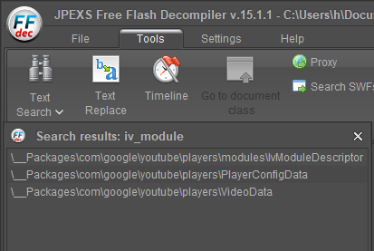
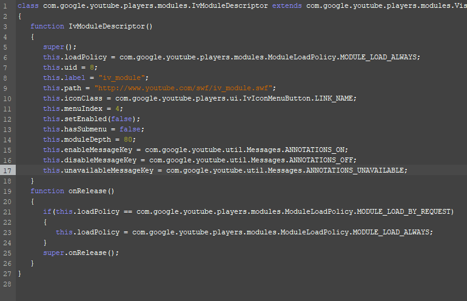
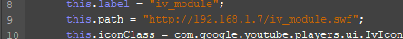
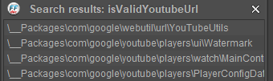
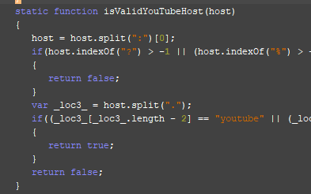
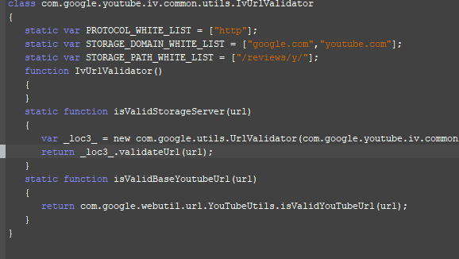
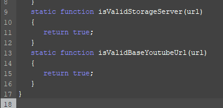

# flash additions

the 2009 flash player has additional functionality you can enable within yt2009: annotations and captions.

*captions coming soon*

codenames used through the doc:
- annotations - `iv_module`

both are separated into their own SWF module files, stored in the root dir of yt2009 (/).

## iv_module

iv_module is used to request and show annotations for a video.

youtube's official annotations api is gone, so yt2009 pulls them from [archive.org](https://archive.org/details/youtubeannotations).

while annotations will work out of the box for html5, flash's iv_module is more involved in getting it to work.

### video player modifications

this part will cover pointing the player to our iv_module and tricking the player's built-in validator to accept an iv_module outside of youtube.com

**1. open your /watch.swf inside the decompiler and use Text Search to find `iv_module`.**

the first result - `IvModuleDescriptor` is what we're interested in. open the file.

*example ivmoduledescriptor*

edit the script to change the path reached by the player to the iv_module. change `www.youtube.com/swf/` to your yt2009 ip/domain, for example: `192.168.1.7`.

---

**2. perform a text search for `isValidYoutubeUrl`.**

as before - the first result is what you're interested in. open the file.

*example validator*

to trick this validator into accepting our iv_module (where it normally wouldn't, because the iv_module is not stored on youtube.com), change the last `return false;` to `return true;`.

### save your video player and continue to the next part.

---

## iv_module modifications

the iv_module is a separate .swf file, bundled within yt2009 on at /iv_module.swf. open it within the decompiler.

**if using bundled iv_module**:

text search for `192.168.1.7`. swap all occurences with your ip.

**if using different iv_module (or if above didn't work)**:

open `com/google/youtube/iv/common/Config`.

- find the `YOUTUBE_DOMAINS` array and add your yt2009 ip+domain combinations into it.
- find the `DEFAULT_YOUTUBE_BASE_URL` variable. by default it will contain `"http://www.youtube.com/"`.
change it to your full HTTP yt2009 path. for example: `"http://192.168.1.7/"`
- find the `DEFAULT_STORAGE_SERVER_BASE_URL` variable. by default it will contain `"http://www.google.com/reviews/y/"`.
once agian, change it to your full HTTP yt2009 path.

open `com/google/youtube/players/CrossDomainer`.
- add your ip+domain combinations of yt2009 to the `ALLOWED_SECURITY_DOMAINS` variable.

open `com/google/youtube/players/PlayerConfigData`.
- set your `LIVE_BASE_URL` from `"http://www.youtube.com/"` to your full HTTP yt2009 path, just like in the iv_module's Config script.

open `com/google/youtube/iv/common/utils/IvUrlValidator`.

*IvUrlValidator*

make the validator pass your off-YouTube modules and server by changing its code, similarly to how it was done in the video player itself.

