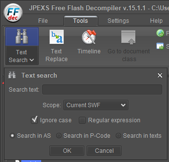
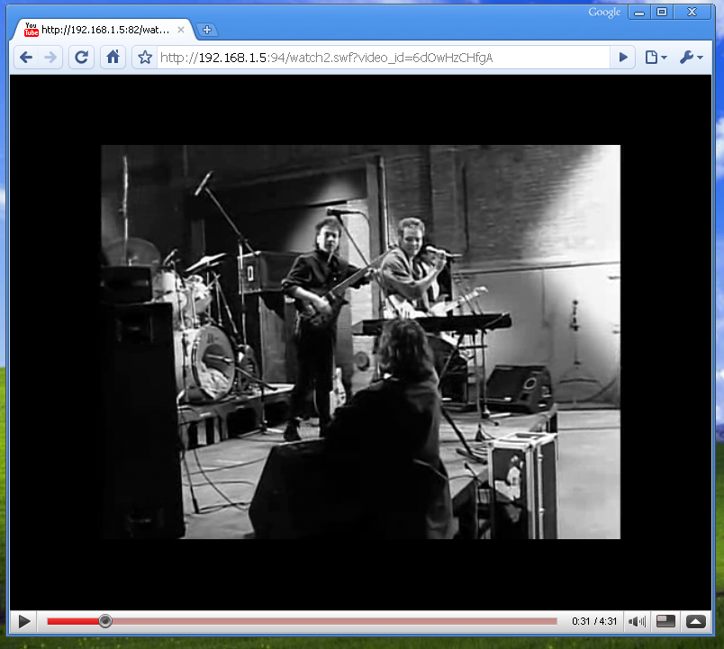

# patching old youtube flash players

as you might know, flash players are an important part of old youtube. while they were never great and reliable, it was one of the only ways of playing videos in a browser, especially in a time yt2009 aims to recreate.

yt2009 also supports flash players, but they need additional setup. this readme will guide you through getting flash players to work with your self-hosted yt2009 instance.

---
## prerequisites
- flash player decompiler: https://github.com/jindrapetrik/jpexs-decompiler/releases/tag/version15.1.1

*JPEXS 15.1.1 is used throughout this tutorial. newer versions tend to not be as reliable and easy to use.*

- a .swf file of the player,
- flash player projector.

---
## finding where youtube.com is mentioned

in most cases, youtube.com is hard-coded as a domain name to connect to with the flash player.

- open the .swf file in your flash decompiler if you haven't done so already
- open the Tools tab in the decompiler and click Text Search (like in the screenshot below)



- search for youtube.com, make sure **Ignore case** is checked.

---
## change required lines of code

**the following steps vary from player to player.**

in most cases, you will need to change both a BASE_URL and some security rules for your player to connect.

files containing BASE_URL:
```
2005: frame 1\DoAction
2006-2007: frame 1\DoAction,
           __Packages\logic\Movie,
           __Packages\logic\MovieLoader
2008-early 2010: __Packages\com\google\youtube\players\PlayerConfigData,
                 __Packages\com\google\youtube\players\VideoLoader
late 2010-*: __Packages\com\google\youtube\model\YouTubeEnvironment 
```

security rules:
```
2005-2007: N/A
2008-early 2010: __Packages\com\google\youtube\players\CrossDomainer
late 2010-*: __Packages\com\google\youtube\model\YouTubeEnvironment,
             __Packages\com\google\youtube\util\UrlValidator,
```

---
## BASE_URL

- open the file containing your BASE_URL

- find a variable along the lines of BASE_URL

- edit the script and change the youtube.com address to your yt2009 instance.

*it's recommended to use the IP you set while configuring yt2009.*

*also make sure to include the path to the **whole http version** of your yt2009 instance*

- save the script file.

---
## security rules

- look for security-related lines in your file listed above. common examples:

```
static var ALLOWED_SECURITY_DOMAINS = ["www.youtube.com",...
```

```
Security.allowDomain("www.youtube.com");
```

- open files that have those guidelines in the compiler and add rules to allow your own instance ip.

*when adding rules, to ensure reliability, add both ip/domain and (ip/domain):port paths.*

*for example, assuming the ip is set to 192.168.1.5, and the port is 94, you'd be adding 2 rules for each security function: `192.168.1.5` and `192.168.1.5:94`.*

- in case of the two examples above, your new rules should look like this:

```
static var ALLOWED_SECURITY_DOMAINS = ["192.168.1.5","192.168.1.5:94","www.youtube.com",...
```

```
Security.allowDomain("192.168.1.5");
Security.allowDomain("192.168.1.5:94");
Security.allowDomain("www.youtube.com");
```

- save the file and the .swf.

---

## testing the swf

---
## important: when testing the patched .swf, use the web address instead of a `file://` address. the latter may experience issues connecting to the internet.
---

- use a flash-compatible environment (flash player projector, old browser with flash)
- navigate to your yt2009instance/flashurl.

*yt2009instance - the url you host yt2009 on.*

*flashurl - the path to the flash file*.

- taking the patched `watch2.swf` as an example, put it into your yt2009 root directory and navigate to:

```
http://192.168.1.5:94/watch2.swf?video_id=youtube_video_id
```

**video_id** is a flash parameter to determine what video should be loaded. in some very rare cases it can be different though.

**youtube_video_id** is what you should replace with an actual ID.

**for faster loading and testing, you can make the yt2009 server send H264 mp4 by adding `/mp4` to the end of the video id.**

- if everything went right, you should see a loading animation, followed by the video itself.



**depending on the length of the video (and if needs to be downloaded first), it can take very long to get the video to start playing. patience is key.**