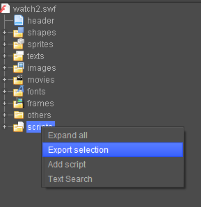
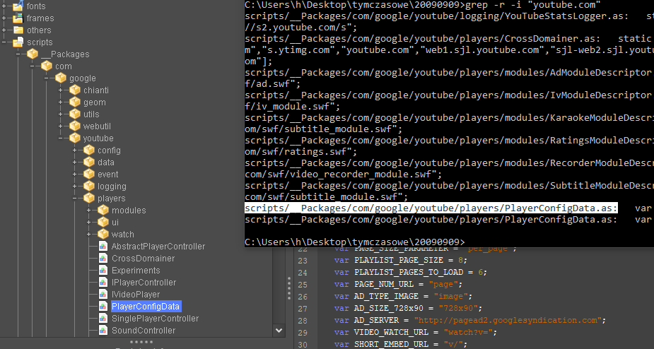

# patching old youtube flash players

as you might know, flash players are an important part of old youtube. while they were never great and reliable, it was one of the only ways of playing videos in a browser, especially in a time yt2009 aims to recreate.

yt2009 also supports flash players, but they need additional setup. this readme will guide you through getting flash players to work with your self-hosted yt2009 instance.

---
## prerequisites
- flash player decompiler: https://github.com/jindrapetrik/jpexs-decompiler
- if using Windows and don't have it already, [grep for windows](https://sourceforge.net/projects/grep-for-windows/files/grep-3.5_win32.zip/download). add to your PATH.
- a .swf file of the player,
- flash player projector.

---
## exporting the scripts, finding where youtube.com is mentioned

in most cases, youtube.com is hard-coded as a domain name to connect to with the flash player.

- open the .swf file in your flash decompiler if you haven't done so already
- look on the left side where you have tree views for shapes, sprites, headers, texts etc. look for the `scripts` section
- right click on the `scripts` dropdown and click **Export selection**.



- leave the script type as ActionScript
- select the directory to export the scripts to and do so.
- once the export is done, open the directory you exported the scripts in a terminal of your choice.

*in most cases, holding down SHIFT and right clicking should give you an option to open the directory*.

- use **grep** to find references of youtube.com.

use a command like this:
```
grep -r -i "youtube.com"
```
where:

-r - recursive

-i - ignore case. for instance, **youtube.com**, **YouTube.com** **yOuTUBE.com** will all match.

---
## change required lines of code

this step varies with each player. but the general rule is to look through your grep output and look for matches related to **base urls** and **security rules**.

the file path grep will report as the match will match the **scripts** tree in the decompiler.



---
## BASE_URL

- first, look for a variable named something like **BASE_URL** in your grep output. open the appropriate file in the decompiler.

*grep will show you the line content where it found the base url being set.*

- look for the line in your script file in the decompiler. edit the script and change the youtube.com address to your yt2009 instance.

*it's recommended to use the IP you set while configuring yt2009.*

*also make sure to include the path to the **whole http version** of your yt2009 instance*

- save the script file.

---
## security rules

- look for security-related lines of code in the grep output. there may be several. some common examples may include:

```
static var ALLOWED_SECURITY_DOMAINS = ["www.youtube.com",...
```

```
Security.allowDomain("www.youtube.com");
```

- open files that have those guidelines in the compiler and add rules to allow your own instance ip.

*when adding rules, to ensure reliability, add both ip/domain and (ip/domain):port paths.*

*for example, assuming the ip is set to 192.168.1.5, and the port is 94, you'd be adding 2 rules for each security function: `192.168.1.5` and `192.168.1.5:94`.*

- in case of the two examples above, your new rules should look like this:

```
static var ALLOWED_SECURITY_DOMAINS = ["192.168.1.5","192.168.1.5:94","www.youtube.com",...
```

```
Security.allowDomain("192.168.1.5");
Security.allowDomain("192.168.1.5:94");
Security.allowDomain("www.youtube.com");
```

- save the file and the .swf.

---

## testing the swf

---
## important: when testing the patched .swf, use the web address instead of a `file://` address. the latter may experience issues connecting to the internet.
---

- use a flash-compatible environment (flash player projector, old browser with flash)
- navigate to your yt2009instance/flashurl.

*yt2009instance - the url you host yt2009 on.*

*flashurl - the path to the flash file*.

- taking the patched `watch2.swf` as an example, put it into your yt2009 root directory and navigate to:

```
http://192.168.1.5:94/watch2.swf?video_id=youtube_video_id
```

**video_id** is a flash parameter to determine what video should be loaded. in some very rare cases it can be different though.

**youtube_video_id** is what you should replace with an actual ID.

- if everything went right, you should see a loading animation, followed by the video itself.


**depending on the length of the video (and if needs to be downloaded first), it can take very long to get the video to start playing. patience is key.**