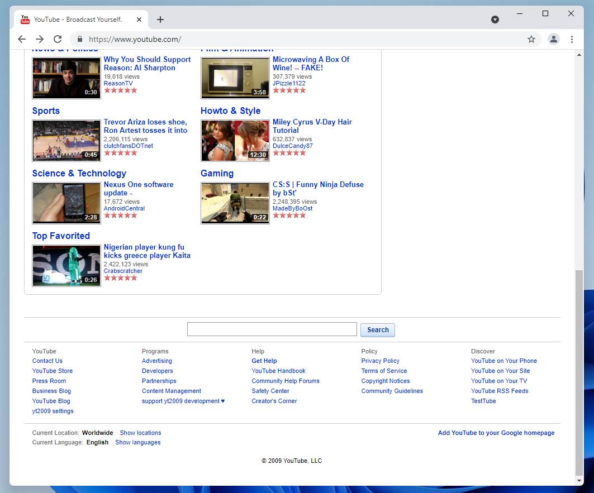
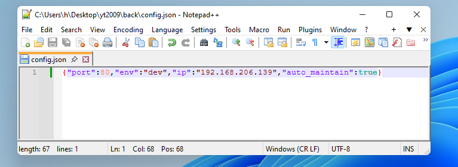
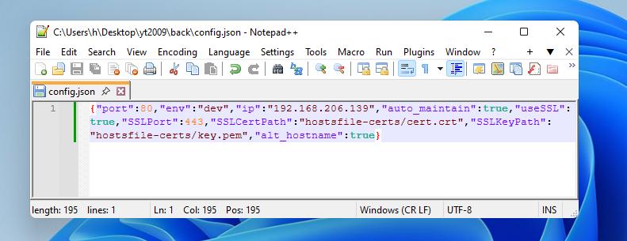
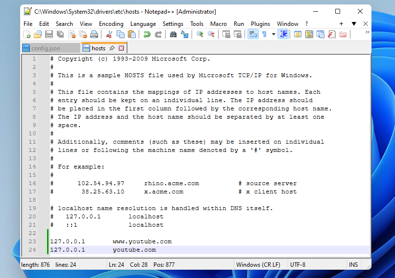
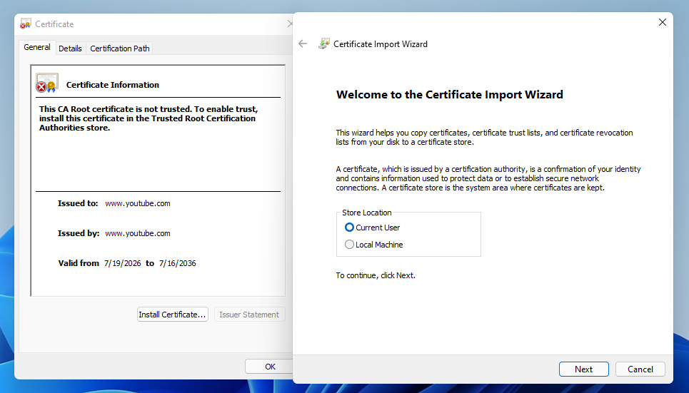
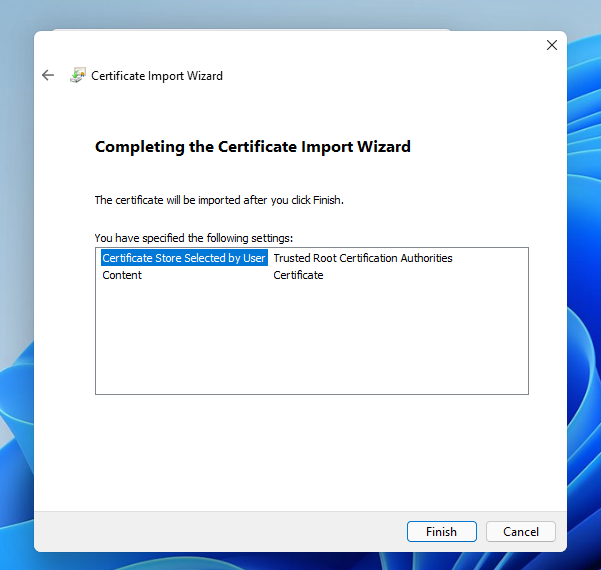
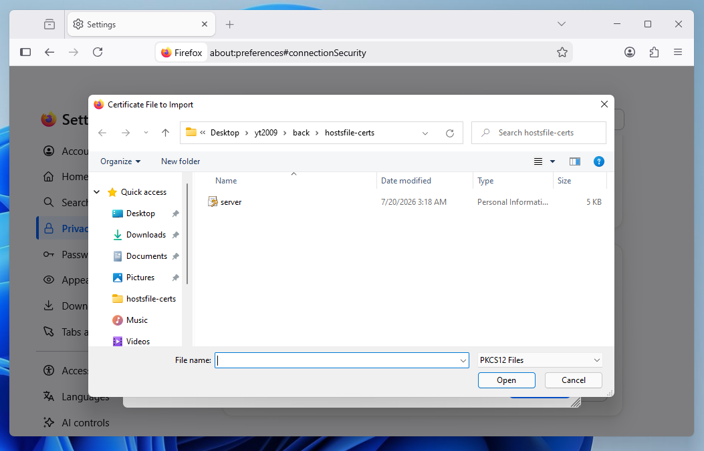

# using yt2009 with hostsfile

*based on [Rehike's hostsfile guide](https://github.com/Rehike/Rehike/wiki/Installation#proxying-rehike-via-hosts-file)*

enables using yt2009 at www.youtube.com.

# 1. editing config

you need to first edit your config.json to use yt2009 with SSL.

a basic, small config generated with yt2009setup will look like this

you need to add following fields to use SSL:
- `useSSL`: `true`
- `SSLPort`: `443`
- `SSLCertPath`: `hostsfile-certs/cert.crt`
- `SSLKeyPath`: `hostsfile-certs/key.pem`
- `alt_hostname`: `true`

where `hostsfile-certs/cert.crt` and `hostsfile-certs/key.pem` are files that exist within the `back` directory,
so you don't need to put their whole path.

you should end up with a config like this:

restart yt2009. if you get an error about port 443 being in use, close any programs that may take it
(such as vmware workstation) and restart yt2009.

# 2. adding entries to hostsfile

**you need to open your text edit as administrator to edit hostsfile.**

the windows hostsfile is located in `C:\Windows\System32\drivers\etc\hosts`.

add entries pointing `youtube.com` and `www.youtube.com` to `127.0.0.1`, like so:

and save.

# 3. adding certificates

find the `cert.crt` file in `back/hostsfile-certs`, open it, and click `Install Certificate`.

keep the store location as current user, and click next. select "Place all certificates in the following stores",
and click Browse to get all locations. select Trusted Root Certification Authorities, OK and finish setting up the certificate.

## firefox-specific

firefox keeps its certificates separately, so you'll need to import a certificate there as well.

open settings, privacy and security -> manage certificates. you can also get there by just searching "certificates".

import the `server.p12` file from `back/hostsfile-certs` into Your Certificates. if you're asked for a password, leave the field empty.

# 4.

RESTART ALL BROWSERS. sometimes, a PC restart may work as well.

if you get the current youtube layout even after doing all of this, press ctrl+f5 to clear caches on youtube.com

## **DISABLE ALL EXTENSIONS RUNNING ON YOUTUBE WHEN RUNNING YT2009 ON WWW.YOUTUBE.COM.**

(adblockers, alternative frontends, enhancers such as sponsorblock. THEY WILL NOT WORK WITH YT2009.)

## **REPORTING AN ISSUE CAUSED BY EXTENSIONS RUNNING ON WWW.YOUTUBE.COM WILL BE CLOSED WITHOUT WARNING.**