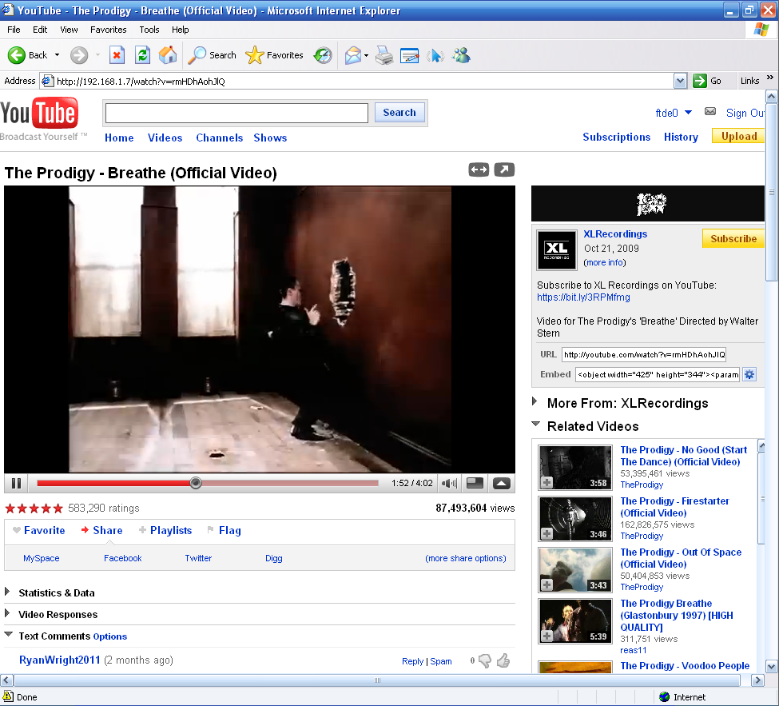
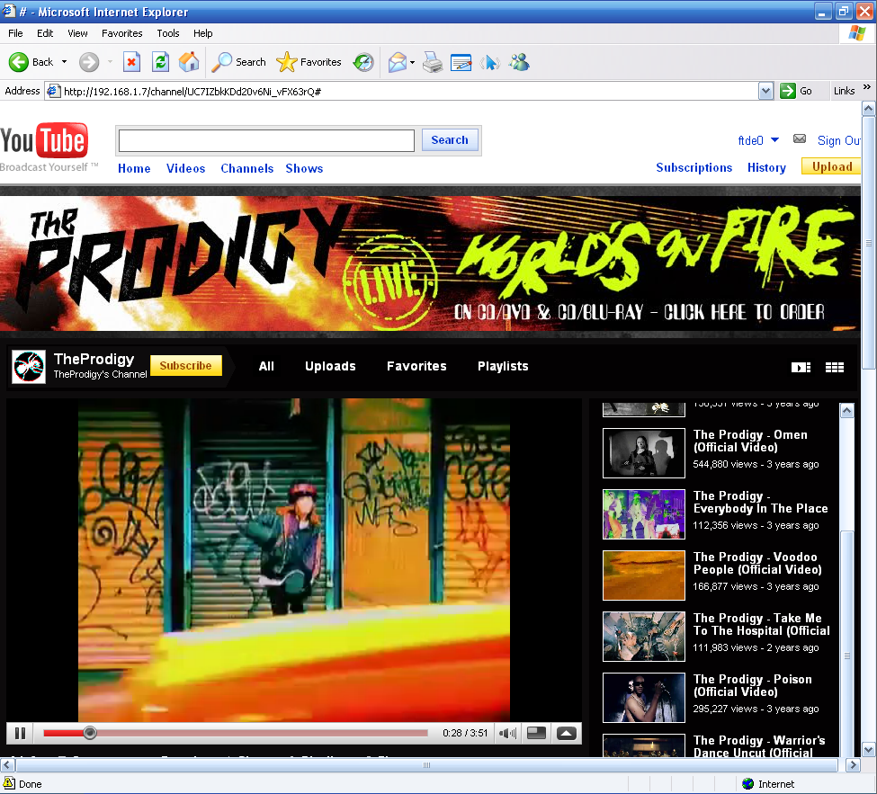

# yt2009
a fairly accurate 2009 youtube frontend.




---

## setup
### if you prefer using docker rather than installing directly, go [here](docker.md) for setup instructions instead

- **make sure you have [imagemagick](https://imagemagick.org/) and [ffmpeg](https://ffmpeg.org/) in your PATH.**

### when installing imagemagick, make sure you also install its legacy tools (convert)! 

- install node.js
- open a terminal (windows powershell/cmd) in the directory you cloned yt2009 to, then:
- install required dependencies with: `npm install`
- create a config file by launching and following: `node yt2009setup.js`
- run to set and download remaining assets `node post_config_setup.js`
- run yt2009 by changing directory to `back` (`cd back`) and starting with `node backend.js`
- navigate to your IP:port you have set while configuring to see a 2009 homepage.

afterwards, you can just `cd back` and `node backend.js` to start. no need to re-set it up each time.

---

## optional after-setup steps

### - **if experiencing issues with ytdl-core, apply this pull. https://github.com/fent/node-ytdl-core/pull/1217**

**as of november 2023, it still isn't merged with the main repo.**

- patch the flash player(s) by following [flash_player_patch.md](flash_player_patch.md) and looking through [alt-swf/readme.md](alt-swf/readme.md).

### some SWFs included here may be pre-patched for a different yt2009 url. make sure to replace the urls to your own if you come across those. 

- set up an android app by following [apk_setup.md](apk_setup.md)

---

## updating

if you want to update your frontend instance, use

```
git pull --no-commit
```

to get you up with updates you may have missed.

if you modified the code yourself and you're getting a merge conflict, use

```
git checkout -- <file>
```

to restore the original file. you can make a copy of your modified file and reapply the mod after the pull is done.

---

## usage

now that you're in, you can just use it as it is, but there is a bit more you can do.

navigate to **/flags** to change settings locally. here, for example, you can set up The Wayback Machine as a video data source. but look through, there is a lot more.

feel free to nav to **/toggle_f** if you've set up flash players as described above to make the frontend work on older browsers, such as ie6.

and just click around! you might find some useful features you didn't expect to work.

---

**over time, depending on your usage, yt2009 may take up a lot of space (counted in tens of gigabytes!)**

**if you need to reclaim space, look through the assets folder where downloaded files (such as images, videos) are saved and delete ones you need.**

**they will be redownloaded when necessary.**

---