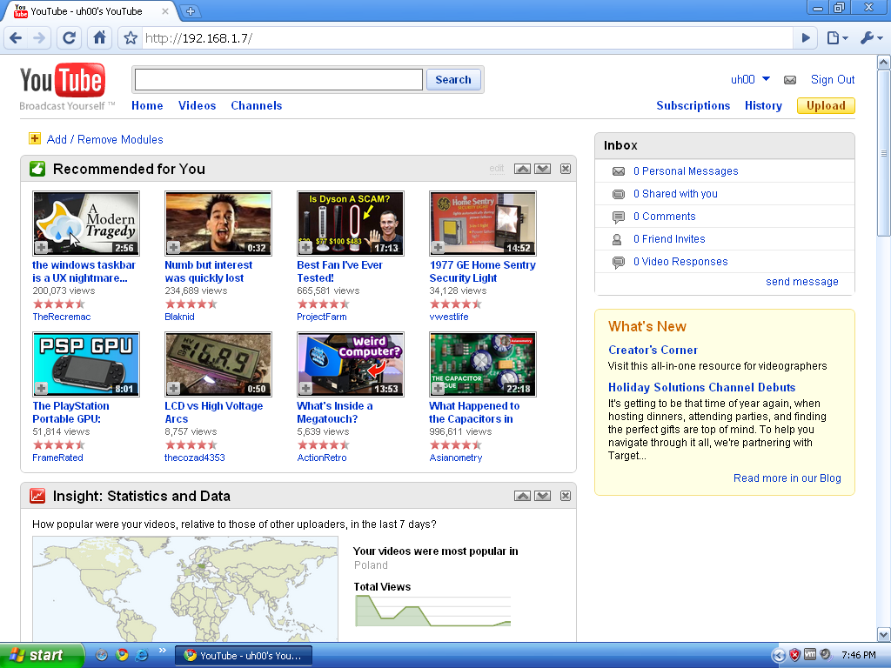
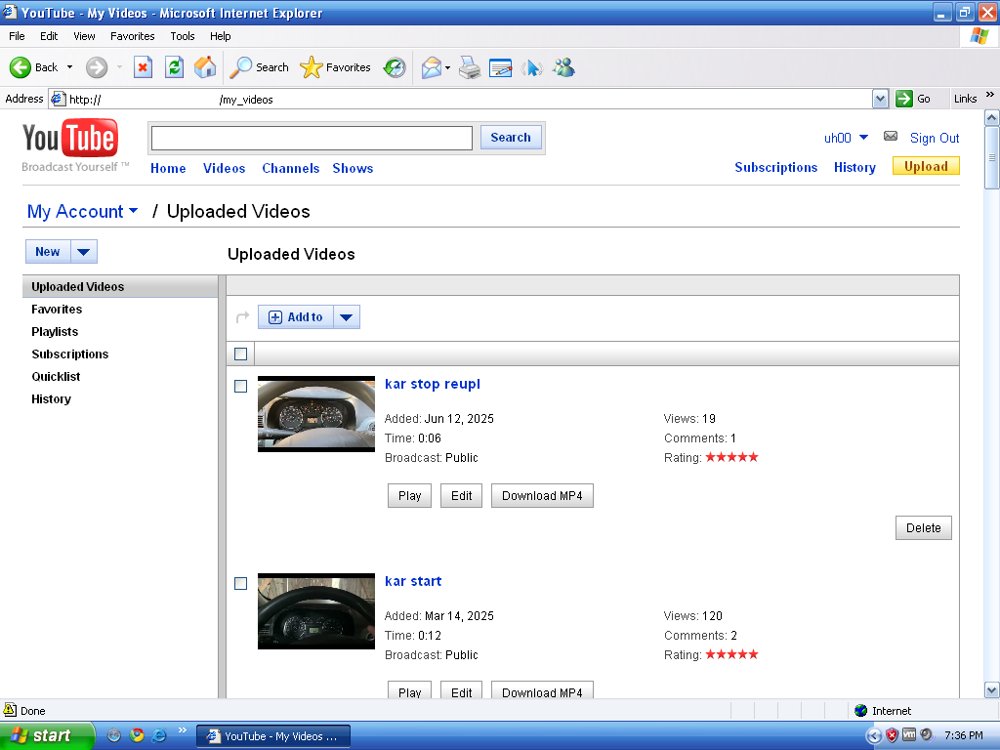

# yt2009
a fairly accurate 2009 youtube frontend with account features.


---

## setup
### if you prefer using docker rather than installing directly, go [here](docker.md) for setup instructions instead
### if hosting on windows xp, follow [xp specific instructions](windowsxp.md) instead.

- **make sure you have [imagemagick](https://imagemagick.org/) and [ffmpeg](https://ffmpeg.org/) in your PATH.**

- install node.js
- open a terminal (windows powershell/cmd) in the directory you cloned yt2009 to, then:
- install required dependencies with: `npm install`
- create a config file by launching and following: `node yt2009setup.js`
- run to set and download remaining assets `node post_config_setup.js`
- run yt2009 by changing directory to `back` (`cd back`) and starting with `node backend.js`
- navigate to your IP:port you have set while configuring to see a 2009 homepage.

afterwards, you can just `cd back` and `node backend.js` to start. no need to re-set it up each time.

---

it is highly recommended to add a google data api v3 key to ensure all video data is shown correctly.

you will also be notified about that when starting the frontend without one set.

more info in [config_params.md](config_params.md) / [docker.md](docker.md). obtain a key at https://console.developers.google.com/.

---

## !! if hosting on windows 7 !!

the last version of node.js supported on windows 7 doesn't support the latest version of express, so you might experience crashes on start.

install an older one to host yt2009 on windows 7:

```
npm install express@4.17.1
```

if still facing issues take a look at #243.

## updating

if you want to update your frontend instance, use

```
git pull --no-commit
```

to get you up with updates you may have missed.

if you modified the code yourself and you're getting a merge conflict, use

```
git checkout -- <file>
```

to restore the original file. you can make a copy of your modified file and reapply the mod after the pull is done.

---

## usage

now that you're in, you can just use it as it is, but there is a bit more you can do.

navigate to **/flags** to change settings locally. here, for example, you can set up The Wayback Machine as a video data source. but look through, there is a lot more.

feel free to nav to **/toggle_f** to enable flash player support for old browsers, such as ie6.

sign in! click on the upload button or go to **/mh_pc_intro** to connect and interact with your **actual** youtube account.




---

**over time, depending on your usage, yt2009 may take up a lot of space (counted in tens of gigabytes!)**

**if you need to reclaim space, look through the assets folder where downloaded files (such as images, videos) are saved and delete ones you need.**

**they will be redownloaded when necessary.**

alternatively, set up auto_maintain as described in yt2009setup to handle this for you.

---

## notes, docs

over time some tools and documentation was written about yt2009. for an easy reference, those are listed below.

- [apk_setup.md](apk_setup.md) - set early youtube android APKs to work with yt2009
- [config_params.md](config_params.md) - a list of ALL available config options.
- [docker.md](docker.md) - yt2009 setup with docker. also listed in the setup section. (thanks, breakgimme!)
- [flash_additions.md](flash_additions.md) - some info on caption and annotations modules within the default 2009 flash player.
- [flash_player_patch.md](flash_player_patch.md) - manual patch info for using flash players with yt2009.


- [autoapk.js](autoapk.js) - a node cli file to automatically patch APKs supported by yt2009. your mileage may vary.